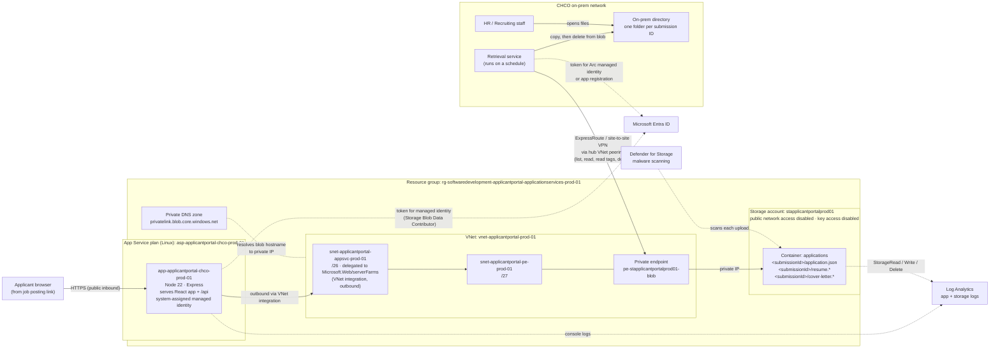

# Azure Deployment

How to deploy the applicant portal to **Azure App Service** (`app-applicantportal-chco-prod-01`) and store each submission in **Azure Blob Storage** (`stapplicantportalprod01`), with one folder per submission ID.

```
stapplicantportalprod01 (storage account)
└── applications (container)
    ├── 12345_20260923-141502_a1b2c3/
    │   ├── application.json
    │   ├── resume.pdf
    │   └── cover-letter.docx        (only if one was uploaded)
    └── 67890_20260923-151744_d4e5f6/
        ├── application.json
        └── resume.docx
```

Blob Storage has no real directories. A "folder" is a name prefix: a blob named `<submissionId>/application.json` appears as `application.json` inside a `<submissionId>` folder in the Azure Portal and Storage Explorer.

## Architecture



How a submission flows:

1. The applicant opens the site from a job posting, completes the wizard and submits. The browser POSTs the application and files to `/api/applications` over the public internet (HTTPS).
2. The web app validates the submission and generates a submission ID. It then gets an access token for its managed identity from Microsoft Entra ID; there are no keys or connection strings.
3. The web app's outbound traffic goes through VNet integration. The private DNS zone resolves `stapplicantportalprod01.blob.core.windows.net` to the private endpoint's IP address, so the upload never leaves the private network.
4. The files are written to `applications/<submissionId>/`, with `application.json` written last. The applicant sees the submission ID as their confirmation number.
5. Defender for Storage scans each uploaded file and tags it with the result.
6. On a schedule, the on-prem retrieval service picks up each complete, scanned-clean submission folder, copies it into a directory on an on-prem server, and deletes it from Blob Storage ([section 10](#10-on-prem-retrieval-service)). HR opens the files from that directory and never accesses the storage account.

Blob Storage is therefore a short-term drop zone, not the system of record. Submissions normally stay in it only until the next run of the retrieval service.

The private networking pieces (VNet, subnets, private endpoint, private DNS zone) are set up in [section 11](#11-hardening-recommended). Until they are in place, the web app reaches the storage account over its public endpoint, still authenticated with its managed identity.

## Contents

1. [Prerequisites](#1-prerequisites)
2. [Variables](#2-variables)
3. [Resource group](#3-resource-group)
4. [Storage account and container](#4-storage-account-and-container)
5. [App Service plan and web app](#5-app-service-plan-and-web-app)
6. [Managed identity and storage access](#6-managed-identity-and-storage-access)
7. [Code changes: write submissions to Blob Storage](#7-code-changes-write-submissions-to-blob-storage)
8. [Build and deploy](#8-build-and-deploy)
9. [Verify](#9-verify)
10. [On-prem retrieval service](#10-on-prem-retrieval-service)
11. [Hardening (recommended)](#11-hardening-recommended)
12. [Redeploying](#12-redeploying)
13. [Troubleshooting](#13-troubleshooting)

---

## 1. Prerequisites

- An Azure subscription, with permission to create resources and **assign roles** (Owner, or Contributor plus User Access Administrator) on the target resource group.
- [Azure CLI](https://learn.microsoft.com/cli/azure/install-azure-cli) 2.60 or later, signed in with `az login`.
- Node.js 22 LTS and npm on the build machine.
- The commands below use **bash** syntax. On Windows, run them in Git Bash or Azure Cloud Shell. In PowerShell, replace the `\` line continuations with backticks and `VAR=value` with `$VAR = "value"`.

## 2. Variables

Set these once per shell session. **Confirm the region and plan name with the Azure/Cloud team before running anything.** The resource group, web app and storage account names are fixed.

```bash
SUBSCRIPTION="<subscription-id-or-name>"
RG="rg-softwaredevelopment-applicantportal-applicationservices-prod-01"
LOCATION="centralus"                           # placeholder, confirm
PLAN="asp-applicantportal-chco-prod-01"        # placeholder, confirm
APP="app-applicantportal-chco-prod-01"
STORAGE="stapplicantportalprod01"
CONTAINER="applications"

az account set --subscription "$SUBSCRIPTION"
```

## 3. Resource group

Skip this step if the resource group already exists.

```bash
az group create --name "$RG" --location "$LOCATION"
```

## 4. Storage account and container

Submissions contain applicant PII (names, addresses, phone numbers, work history, resumes). The account is therefore created with public blob access and shared-key (account key / SAS) access disabled. Only Microsoft Entra identities with an RBAC role can read or write blobs.

### 4.1 Create the storage account

```bash
az storage account create \
  --name "$STORAGE" \
  --resource-group "$RG" \
  --location "$LOCATION" \
  --kind StorageV2 \
  --sku Standard_ZRS \
  --access-tier Hot \
  --https-only true \
  --min-tls-version TLS1_2 \
  --allow-blob-public-access false \
  --allow-shared-key-access false \
  --default-action Allow
```

- `Standard_ZRS` keeps copies in three availability zones in one region. Use `Standard_GRS` or `Standard_GZRS` if CHCO policy requires a copy in a second region. If the region does not support ZRS, use `Standard_LRS`.
- `--default-action Allow` leaves the account reachable over the public internet, though only with Entra authentication. To limit it to private network traffic, see [Hardening](#11-hardening-recommended).

### 4.2 Enable data protection

Soft delete lets you recover a deleted submission or container for 30 days. Versioning keeps prior versions if a blob is ever overwritten.

```bash
az storage account blob-service-properties update \
  --account-name "$STORAGE" \
  --resource-group "$RG" \
  --enable-delete-retention true --delete-retention-days 30 \
  --enable-container-delete-retention true --container-delete-retention-days 30 \
  --enable-versioning true
```

With versioning on, a deleted blob isn't really gone. Deleting the current version turns it into a previous version, which is kept until something deletes it. The retrieval service deletes every submission after copying it on-prem, so without a cleanup rule, a copy of every application and resume would pile up in Azure indefinitely. This lifecycle rule deletes previous versions after 30 days, the same window as soft delete:

```bash
cat > lifecycle.json <<'EOF'
{
  "rules": [
    {
      "enabled": true,
      "name": "delete-previous-versions-after-30-days",
      "type": "Lifecycle",
      "definition": {
        "filters": { "blobTypes": ["blockBlob"], "prefixMatch": ["applications/"] },
        "actions": { "version": { "delete": { "daysAfterCreationGreaterThan": 30 } } }
      }
    }
  ]
}
EOF

az storage account management-policy create \
  --account-name "$STORAGE" \
  --resource-group "$RG" \
  --policy @lifecycle.json
```

The result: when the retrieval service deletes a submission, it can still be recovered from Azure for 30 days, and after that it exists only on-prem.

### 4.3 Create the container

This uses the management plane (`container-rm`), so it works even though shared-key access is disabled and before anyone has a data role.

```bash
az storage container-rm create \
  --storage-account "$STORAGE" \
  --resource-group "$RG" \
  --name "$CONTAINER" \
  --public-access off
```

You do not create the per-submission folders. The app creates each one when it writes the first blob with that submission ID prefix.

### 4.4 Portal access for administrators

Because shared-key access is off, the Azure Portal must use Entra authentication to browse blobs:

1. In the Portal, open **stapplicantportalprod01 → Settings → Configuration**.
2. Set **Default to Microsoft Entra authorization in the Azure portal** to **Enabled** and click **Save**.

**HR staff don't get access to the storage account.** They get submissions from the on-prem directory that the retrieval service fills ([section 10](#10-on-prem-retrieval-service)). Only the administrators who support the app need a data role, and only to troubleshoot:

```bash
CONTAINER_SCOPE=$(az storage account show -n "$STORAGE" -g "$RG" --query id -o tsv)/blobServices/default/containers/$CONTAINER

az role assignment create \
  --assignee "<admin-group-object-id-or-upn>" \
  --role "Storage Blob Data Reader" \
  --scope "$CONTAINER_SCOPE"
```

Use **Storage Blob Data Contributor** instead for admins who also need to delete test submissions ([section 9](#9-verify)).

## 5. App Service plan and web app

### 5.1 Create the Linux plan and the web app

```bash
az appservice plan create \
  --name "$PLAN" \
  --resource-group "$RG" \
  --location "$LOCATION" \
  --is-linux \
  --sku P0V3

az webapp create \
  --name "$APP" \
  --resource-group "$RG" \
  --plan "$PLAN" \
  --runtime "NODE:22-lts"
```

- `P0V3` is the smallest Premium v3 tier, and it supports VNet integration, zone redundancy and deployment slots. `B1` also works for a low-traffic site, but it has no slots.
- Run `az webapp list-runtimes --os linux` to see which Node runtime strings are available. Express 5 requires Node 18 or later.

### 5.2 General configuration

```bash
az webapp update --name "$APP" --resource-group "$RG" --https-only true

az webapp config set \
  --name "$APP" \
  --resource-group "$RG" \
  --always-on true \
  --http20-enabled true \
  --min-tls-version 1.2 \
  --ftps-state Disabled \
  --startup-file "node server/index.js" \
  --generic-configurations '{"healthCheckPath": "/"}'
```

- The startup command runs the Express server. The server serves the built React app from `client/dist` and the API from `/api`.
- The server already reads `PORT`, which App Service sets automatically. Do not set `PORT` yourself.
- `server/index.js` already calls `app.set('trust proxy', true)`, so `req.ip` is the applicant's IP and not the App Service front end's.
- The health check uses `/` because the SPA fallback returns `200` for it. There is no dedicated health endpoint.

### 5.3 App settings

```bash
az webapp config appsettings set \
  --name "$APP" \
  --resource-group "$RG" \
  --settings \
    NODE_ENV=production \
    AZURE_STORAGE_ACCOUNT="$STORAGE" \
    AZURE_STORAGE_CONTAINER="$CONTAINER" \
    TZ=America/Denver \
    SCM_DO_BUILD_DURING_DEPLOYMENT=false
```

| Setting | Why |
| --- | --- |
| `AZURE_STORAGE_ACCOUNT` / `AZURE_STORAGE_CONTAINER` | Where submissions are written (see [section 7](#7-code-changes-write-submissions-to-blob-storage)). When `AZURE_STORAGE_ACCOUNT` is unset, the app falls back to local disk, which is what local development uses. |
| `TZ=America/Denver` | The submission ID contains a `yyyyMMdd-HHmmss` timestamp in **server-local time**. App Service on Linux runs in UTC by default. Setting the time zone keeps IDs and folder names in Colorado time, matching what applicants see. `submittedAt` inside the JSON is always ISO UTC. |
| `SCM_DO_BUILD_DURING_DEPLOYMENT=false` | The zip deployed in [section 8](#8-build-and-deploy) is already built and includes production `node_modules`, so App Service should not run its own build. |

### 5.4 Logging

```bash
az webapp log config \
  --name "$APP" \
  --resource-group "$RG" \
  --docker-container-logging filesystem
```

The server logs `Saved application <submissionId> -> <location>` for each submission, and logs errors to stderr. For long-term log retention, add a diagnostic setting that sends `AppServiceConsoleLogs` to a Log Analytics workspace, or connect Application Insights.

## 6. Managed identity and storage access

The web app authenticates to Blob Storage with its **system-assigned managed identity**, so there are no keys or connection strings to store or rotate.

```bash
PRINCIPAL_ID=$(az webapp identity assign \
  --name "$APP" \
  --resource-group "$RG" \
  --query principalId -o tsv)

CONTAINER_SCOPE=$(az storage account show -n "$STORAGE" -g "$RG" --query id -o tsv)/blobServices/default/containers/$CONTAINER

az role assignment create \
  --assignee-object-id "$PRINCIPAL_ID" \
  --assignee-principal-type ServicePrincipal \
  --role "Storage Blob Data Contributor" \
  --scope "$CONTAINER_SCOPE"
```

- The role is scoped to the `applications` container, not the whole account.
- Role assignments can take **up to 10 minutes** to take effect. Until then, uploads fail with `403 AuthorizationPermissionMismatch`.
- Least privilege (optional): the app only needs to create blobs. Instead of the built-in Contributor role, you can assign a custom role whose only data action is `Microsoft.Storage/storageAccounts/blobServices/containers/blobs/write`. The app would then be unable to read or delete existing submissions.

## 7. Code changes: write submissions to Blob Storage

> **Status: done.** These changes are already in the repo. This section documents them for reference; nothing needs to be done here before deploying.

### 7.1 Add the Azure SDK packages

Already in `package.json` / `package-lock.json`. To reproduce from the repo root:

```bash
npm install @azure/storage-blob @azure/identity
```

### 7.2 `server/storage.js`

`server/storage.js` writes to Blob Storage when `AZURE_STORAGE_ACCOUNT` is set, and to local disk otherwise, so `npm run dev` keeps working without Azure. The submission ID format and the `application.json` shape (including the `attachments` block) do not change.

```js
import fs from 'node:fs/promises';
import path from 'node:path';
import crypto from 'node:crypto';
import { BlobServiceClient } from '@azure/storage-blob';
import { DefaultAzureCredential } from '@azure/identity';

export const SUBMISSIONS_DIR = path.resolve(process.env.SUBMISSIONS_DIR || 'submissions');

// Blob Storage when AZURE_STORAGE_ACCOUNT is set (Azure), local disk otherwise (dev).
// DefaultAzureCredential uses the App Service managed identity in Azure and `az login` locally.
const STORAGE_ACCOUNT = process.env.AZURE_STORAGE_ACCOUNT;
const container = STORAGE_ACCOUNT
  ? new BlobServiceClient(`https://${STORAGE_ACCOUNT}.blob.core.windows.net`, new DefaultAzureCredential())
      .getContainerClient(process.env.AZURE_STORAGE_CONTAINER || 'applications')
  : null;

export const STORAGE_TARGET = container ? container.url : SUBMISSIONS_DIR;

function timestamp(d = new Date()) {
  const p = (n) => String(n).padStart(2, '0');
  return `${d.getFullYear()}${p(d.getMonth() + 1)}${p(d.getDate())}-${p(d.getHours())}${p(d.getMinutes())}${p(d.getSeconds())}`;
}

function safe(s) {
  return String(s).replace(/[^A-Za-z0-9_-]/g, '').slice(0, 40) || 'unknown';
}

export function newSubmissionId(jobOpeningId) {
  return `${safe(jobOpeningId)}_${timestamp()}_${crypto.randomBytes(3).toString('hex')}`;
}

// Writes <submissionId>/<name>; in Blob Storage the prefix shows up as a folder
async function put(submissionId, name, data, contentType) {
  if (container) {
    await container.getBlockBlobClient(`${submissionId}/${name}`).uploadData(data, {
      blobHTTPHeaders: { blobContentType: contentType },
      conditions: { ifNoneMatch: '*' }, // never overwrite an existing submission
    });
  } else {
    const dir = path.join(SUBMISSIONS_DIR, submissionId);
    await fs.mkdir(dir, { recursive: true });
    await fs.writeFile(path.join(dir, name), data);
  }
}

async function writeAttachment(submissionId, baseName, file) {
  if (!file) return null;
  const ext = path.extname(file.originalname).toLowerCase() || '';
  const storedAs = `${baseName}${ext}`;
  await put(submissionId, storedAs, file.buffer, file.mimetype || 'application/octet-stream');
  return { fileName: file.originalname, storedAs, mimeType: file.mimetype, size: file.size };
}

export async function saveSubmission(submissionId, application, files) {
  const attachments = {
    resume: await writeAttachment(submissionId, 'resume', files.resume),
    coverLetter: await writeAttachment(submissionId, 'cover-letter', files.coverLetter),
  };

  const record = { ...application, attachments };
  // Written last, so a folder containing application.json is a complete submission
  const json = Buffer.from(JSON.stringify(record, null, 2), 'utf8');
  await put(submissionId, 'application.json', json, 'application/json; charset=utf-8');
  return `${STORAGE_TARGET}/${submissionId}`;
}
```

### 7.3 Startup log in `server/index.js`

The log reports the container URL instead of a local path that is not used:

```diff
-import { newSubmissionId, saveSubmission, SUBMISSIONS_DIR } from './storage.js';
+import { newSubmissionId, saveSubmission, STORAGE_TARGET } from './storage.js';
 ...
 app.listen(PORT, () => {
-  console.log(`Recruit server on http://localhost:${PORT} (submissions -> ${SUBMISSIONS_DIR})`);
+  console.log(`Recruit server on http://localhost:${PORT} (submissions -> ${STORAGE_TARGET})`);
 });
```

No changes to the client or to `server/index.js` routing are needed. If a blob upload fails, the existing `try/catch` in the `/api/applications` handler returns a 500, and the applicant sees "Could not save your application. Please try again." Their draft stays in the browser, so they can retry.

### 7.4 Test against real Blob Storage locally (optional)

Give your own account **Storage Blob Data Contributor** on the container (as in [section 6](#6-managed-identity-and-storage-access), using `--assignee <your-upn>`), run `az login`, then:

```bash
AZURE_STORAGE_ACCOUNT=stapplicantportalprod01 AZURE_STORAGE_CONTAINER=applications npm run dev
```

Prefer a separate non-production storage account for this, so test submissions don't mix with real ones.

## 8. Build and deploy

The deployment zip is built on a build machine or CI agent. It contains only what production needs:

```
app.zip
├── package.json
├── package-lock.json
├── server/
├── client/dist/          (built React app)
└── node_modules/         (production dependencies only)
```

### 8.1 Build the client

From the repo root:

```bash
npm ci              # postinstall also installs client/ deps
npm run build       # tsc -b && vite build -> client/dist (fails on type errors)
```

### 8.2 Assemble the package

```bash
rm -rf deploy app.zip
mkdir -p deploy/client
cp -r server package.json package-lock.json deploy/
cp -r client/dist deploy/client/dist

# Production deps only. --ignore-scripts skips the postinstall that would install client/ deps.
(cd deploy && npm ci --omit=dev --ignore-scripts)

# Zip the contents of deploy/ (not the folder itself)
(cd deploy && tar -a -c -f ../app.zip *)
```

- On Windows, `tar` is the built-in `tar.exe`. With `-a` and a `.zip` extension it produces a standard zip with forward-slash paths. Avoid PowerShell 5.1's `Compress-Archive`: it writes backslash paths, which break extraction on Linux App Service.
- On Linux/macOS you can use `(cd deploy && zip -r ../app.zip .)` instead.
- All production dependencies are pure JavaScript, so a `node_modules` built on Windows runs on Linux App Service.

### 8.3 Deploy

```bash
az webapp deploy \
  --name "$APP" \
  --resource-group "$RG" \
  --src-path app.zip \
  --type zip
```

App Service extracts the zip into `/home/site/wwwroot` and restarts the app with the startup command from [section 5.2](#52-general-configuration).

### 8.4 CI/CD (optional)

Sections 8.1 to 8.3 can run unchanged in a GitHub Actions or Azure DevOps pipeline. Have the pipeline authenticate to Azure with a workload identity federation (OIDC) service connection, not a stored secret, and give that identity the **Website Contributor** role on the web app.

## 9. Verify

1. **Site loads.** Open
   `https://app-applicantportal-chco-prod-01.azurewebsites.net/?jobopeningid=TEST001&jobtitle=Deployment%20Test`.
   The wizard should render with "Deployment Test" in the header.

2. **Startup log is correct.**

   ```bash
   az webapp log tail --name "$APP" --resource-group "$RG"
   ```

   Look for `submissions -> https://stapplicantportalprod01.blob.core.windows.net/applications`.

3. **Submit a test application** using the sample resume in `test-resume/`. Note the confirmation number shown; it is the submission ID.

4. **Check that the folder and files exist in Blob Storage:**

   ```bash
   az storage blob list \
     --account-name "$STORAGE" \
     --container-name "$CONTAINER" \
     --auth-mode login \
     --prefix "<submissionId>/" \
     --query "[].name" -o tsv
   ```

   Expected output:

   ```
   <submissionId>/application.json
   <submissionId>/resume.pdf
   ```

   Download `application.json` and check that `submissionId` matches the folder name and that `attachments.resume.storedAs` is `resume.pdf`.

5. **Clean up** the test submission:

   ```bash
   az storage blob delete-batch \
     --account-name "$STORAGE" \
     --source "$CONTAINER" \
     --auth-mode login \
     --pattern "<submissionId>/*"
   ```

   If the retrieval service ([section 10](#10-on-prem-retrieval-service)) is already running, it may pick up the test submission before you check. In that case, look for the folder in the on-prem directory, and delete it there after telling HR it's a test.

## 10. On-prem retrieval service

HR gets applications from a directory on an on-prem server. A service that CHCO builds and runs on-prem periodically moves new submissions from Blob Storage into that directory. This section is the contract that service must follow, plus the Azure and network setup it needs. The service itself isn't part of this repo.

### 10.1 What each run must do

1. **List submission folders.** List the blobs in the `applications` container using `/` as the delimiter. Each prefix returned (`<submissionId>/`) is one submission.
2. **Skip incomplete submissions.** The web app writes `application.json` **last**, after the resume and cover letter. A folder with no `application.json` is still being written (or its upload failed partway). Leave it, and check again on the next run.
3. **Skip files that haven't passed the malware scan.** Defender for Storage adds a blob index tag named `Malware Scanning scan result` to each file:
   - `No threats found`: the file is safe to copy.
   - Tag missing: the scan hasn't finished yet. Skip the whole folder until the next run.
   - Any other value (for example `Malicious`): don't copy the folder. Alert Security (and HR, per CHCO's process) and leave the folder for Security to deal with.

   Copy a folder only when **every** file in it is marked `No threats found`. Skip this check only if Defender for Storage isn't enabled.
4. **Copy into a staging folder.** Download every blob in the folder into a staging folder on the **same volume** as the HR directory, for example `D:\ApplicantPortal\.incoming\<submissionId>\`. Check that each downloaded file's size matches the blob's size.
5. **Publish the folder.** Rename (move) the staging folder to `D:\ApplicantPortal\<submissionId>\`. A rename on the same volume is atomic, so HR never sees a half-copied folder.
6. **Delete the submission from Blob Storage**, but only after step 5 succeeds. Delete every blob under `<submissionId>/`. Soft delete and the lifecycle rule in [section 4.2](#42-enable-data-protection) keep a recoverable copy in Azure for 30 days.
7. **Log each submission ID** that was moved, skipped or quarantined, and alert on errors.

The run must also be safe to repeat. If a previous run crashed after step 5 but before step 6, `D:\ApplicantPortal\<submissionId>\` already exists. In that case, compare it to the blobs and then delete the blobs; don't copy the folder a second time. Submission IDs are unique, so an existing folder always means the same submission.

Other requirements:

- **Schedule.** Every 15 minutes is a reasonable default. Agree on the interval with HR, based on how quickly they expect new applications.
- **Alert on a stuck backlog.** An `application.json` older than a few hours still sitting in the container means the service has stopped or is failing.
- **Tooling.** The service can be PowerShell (the `Az.Storage` module) or any language with an Azure Storage SDK (.NET, Python, Node, Java). AzCopy alone isn't enough, because it can't do the completeness and malware-scan checks.

### 10.2 Identity and permissions

The on-prem server can't use the web app's managed identity. Give the service its own Entra identity, in order of preference:

1. **Azure Arc managed identity.** If the server is onboarded to Azure Arc, it gets a managed identity. There are no secrets to store or rotate.
2. **App registration with a certificate.** Create an app registration (service principal) in Entra ID with a certificate credential, and install the certificate in the service account's certificate store. Don't use a client secret.

Grant that identity a custom role at the container scope, with only the permissions the service needs. It can list, read, read tags and delete, but it can't write or change anything:

```bash
cat > retrieval-role.json <<EOF
{
  "Name": "Applicant Portal Retrieval",
  "Description": "List, read, read index tags and delete blobs in the applicant portal container.",
  "Actions": [],
  "DataActions": [
    "Microsoft.Storage/storageAccounts/blobServices/containers/blobs/read",
    "Microsoft.Storage/storageAccounts/blobServices/containers/blobs/tags/read",
    "Microsoft.Storage/storageAccounts/blobServices/containers/blobs/delete"
  ],
  "AssignableScopes": ["$(az group show -n "$RG" --query id -o tsv)"]
}
EOF

az role definition create --role-definition @retrieval-role.json

CONTAINER_SCOPE=$(az storage account show -n "$STORAGE" -g "$RG" --query id -o tsv)/blobServices/default/containers/$CONTAINER

az role assignment create \
  --assignee-object-id "<retrieval-service-principal-object-id>" \
  --assignee-principal-type ServicePrincipal \
  --role "Applicant Portal Retrieval" \
  --scope "$CONTAINER_SCOPE"
```

### 10.3 Network path from on-prem

With public network access disabled on the storage account, the server can reach it **only through the private endpoint**. The network team needs to provide:

- **Connectivity.** ExpressRoute or a site-to-site VPN from the on-prem network to CHCO's hub VNet, with `vnet-applicantportal-prod-01` peered to the hub. Alternatively, place the private endpoint in a VNet that on-prem can already reach.
- **DNS.** On-prem DNS must resolve `stapplicantportalprod01.blob.core.windows.net` to the private endpoint's IP address, not the public one. This is usually done with a conditional forwarder for `blob.core.windows.net` pointing at an Azure DNS Private Resolver (or DNS forwarder) in the hub. Follow the network team's standard pattern for private endpoints.
- **Firewall.** Allow outbound TCP 443 from the server to the private endpoint's IP address.

Check from the server:

```powershell
Resolve-DnsName stapplicantportalprod01.blob.core.windows.net    # should return a private 10.x / 172.16-31.x / 192.168.x address
Test-NetConnection stapplicantportalprod01.blob.core.windows.net -Port 443    # TcpTestSucceeded : True
```

### 10.4 The on-prem directory

Once the service deletes a submission from Blob Storage, the on-prem directory becomes the **only long-term copy of the application**. Set it up accordingly:

- **Permissions.** The service account gets Modify. The HR/Recruiting group gets the access they need (Read, or Modify if they file or delete applications). Nobody else gets access. Hide the `.incoming` staging folder from HR, or deny them access to it.
- **Backups.** Include the directory in the server's backups.
- **Retention.** HR/Legal's retention period for applicant records applies to this directory, not to Azure.
- **Antivirus.** Keep endpoint antivirus active on the server. Defender for Storage's upload scan is an extra layer, not a replacement.

## 11. Hardening (recommended)

These steps aren't required for the site to work. Review them with CHCO Security before go-live, since the site collects applicant PII.

- **Private networking for storage.** Put the storage account behind a private endpoint and turn off public network access:
  1. Create a VNet with a subnet delegated to `Microsoft.Web/serverFarms` and a second subnet for private endpoints.
  2. Add VNet integration to the web app: `az webapp vnet-integration add --name "$APP" -g "$RG" --vnet <vnet> --subnet <integration-subnet>`.
  3. Create a private endpoint for the storage account's `blob` sub-resource, with a `privatelink.blob.core.windows.net` private DNS zone linked to the VNet.
  4. Set `az storage account update -n "$STORAGE" -g "$RG" --public-network-access Disabled`.

  After this, the on-prem retrieval service reaches the account only through the private endpoint ([section 10.3](#103-network-path-from-on-prem)). Administrators can only browse blobs from a network connected to the VNet.
- **Microsoft Defender for Storage.** Malware scanning on upload checks resumes and cover letters before they leave Azure. The retrieval service only copies files marked clean ([section 10.1](#101-what-each-run-must-do)), so enable this before the service goes live.
- **Retention.** Applicant records are kept long term in the on-prem directory, so HR/Legal's retention period applies there ([section 10.4](#104-the-on-prem-directory)). In Azure, submissions only stay until the retrieval service moves them, plus 30 days of soft delete and old versions ([section 4.2](#42-enable-data-protection)). Don't add an immutability policy to the container, because it would block the service's deletes.
- **Custom domain and certificate.** Bind the public hostname (for example `apply.childrenscolorado.org`) with `az webapp config hostname add` and an App Service managed certificate. Then update the job posting links.
- **Access restrictions.** If the site should only be reachable through Front Door or a WAF, restrict inbound traffic to that service tag with `az webapp config access-restriction add`.
- **Resource locks.** Add a `CanNotDelete` lock to the storage account: `az lock create --name no-delete --lock-type CanNotDelete -g "$RG" --resource "$STORAGE" --resource-type Microsoft.Storage/storageAccounts`.

## 12. Redeploying

For each release, repeat [section 8](#8-build-and-deploy): build, assemble and deploy. Infrastructure, app settings and role assignments persist between deployments.

To avoid downtime on P0V3 or a higher tier, create a `staging` deployment slot, deploy to it (`--slot staging`), verify it, then swap: `az webapp deployment slot swap -g "$RG" -n "$APP" --slot staging`. The staging slot has its own managed identity, and that identity needs its own role assignment on the container.

## 13. Troubleshooting

| Symptom | Likely cause / fix |
| --- | --- |
| Applicant sees "Could not save your application"; logs show `403 AuthorizationPermissionMismatch` | The managed identity has no role on the container, or the assignment hasn't propagated yet (wait about 10 minutes). Re-check [section 6](#6-managed-identity-and-storage-access). |
| Logs show `403 AuthorizationFailure` | The storage firewall is blocking the app. Check the network rules or private endpoint DNS (`nslookup stapplicantportalprod01.blob.core.windows.net` from the Kudu console should resolve to a private IP). |
| Logs show `CredentialUnavailableError` | The managed identity is not enabled on the web app (or slot). Run `az webapp identity show -n "$APP" -g "$RG"`. |
| Portal says "You do not have permissions to list the data using your user account" | Your account needs a Storage Blob Data role, and the Portal must use Entra authorization ([section 4.4](#44-portal-access-for-administrators)). |
| Site returns 503 / "Application Error" after deploy | Check `az webapp log tail`. The usual causes are a missing `node_modules` in the zip, a zip with backslash paths, or a wrong startup command. |
| Blank page or 404 for `/` | `client/dist` is missing from the zip. When `client/dist` doesn't exist, the server skips static hosting. |
| Submission IDs show UTC times | `TZ` app setting is missing ([section 5.3](#53-app-settings)). |
| Files still appear under `/home/site/wwwroot/submissions` | `AZURE_STORAGE_ACCOUNT` is not set ([section 5.3](#53-app-settings)). |
| Admin with a Storage Blob Data role still can't list blobs in the Portal or CLI (`AuthorizationFailure` or a network error) | Public network access is disabled, and you're not on a network connected to the VNet. Browse from the corporate network, or check the files in the on-prem directory. |
| Submissions pile up in the container and never reach the on-prem directory | The retrieval service is stopped or failing. Check its logs. If folders have no `application.json`, the web app's upload failed partway; if files have no `Malware Scanning scan result` tag, Defender scanning isn't enabled or hasn't finished ([section 10.1](#101-what-each-run-must-do)). |
| Retrieval service gets `403 AuthorizationPermissionMismatch` | Its identity is missing the `Applicant Portal Retrieval` role on the container ([section 10.2](#102-identity-and-permissions)), or the assignment hasn't propagated yet. |
| Retrieval service gets `403 AuthorizationFailure`, or can't connect | On-prem DNS resolves the storage account to its public IP, or there's no route to the private endpoint. Run the checks in [section 10.3](#103-network-path-from-on-prem). |
